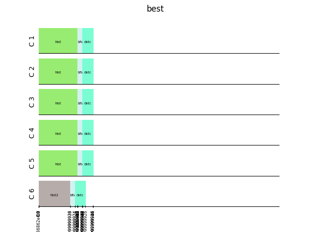
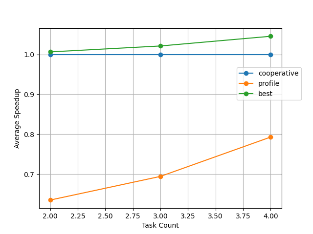

# *Real-Time Systems Project*

## *Spatial Multitasking*

## Master: Ms. Safari

**Erfan Mojibi 99105707**

**Arash Yadegari 99105815**

### Sharif University Of Technology
#### Fall 2024

<p align="center">
    
</p>


# Scheduling

The goal of the schedular is to minimize the Makespan.

## Makespan

**Makespan** of a project is the length of time that elapses from the start of work to the end. This type of multi-mode
resource constrained project scheduling problem (MRCPSP) seeks to create the shortest logical project schedule, by
efficiently using project resources, adding the lowest number of additional resources as possible to achieve the minimum
makespan

## Algorithms

### Cooperative

The first greedy approach is the cooperative scheduling. The cooperative approach tries to minimize the Makespan
locally.

By assigning all cores to a single task, we can expect the minimum execution time. (This may be a bit simplistic, but it
is quite correct most of the time)

This algorithm is implemented in `cooperative.py` file in `CooperativeScheduler` and the main job is done in `run` function which assigns cores and calculates execution times:

```python
class CooperativeScheduler(Scheduler):
    def __init__(self, path: str | None = None, tasks: List[Task] | None = None, core_num: int = 1):
        super().__init__(path=path, tasks=tasks, core_num=core_num, method_name='cooperative')

    def run(self) -> None:
        """
        dedicate all available core to each tasks

        :return:
        """
        start_time = time.time_ns()
        timer = 0.0
        for index, task in enumerate(self.tasks):
            task_exe_time = task.exe_time(self.core_num)
            end_time = timer + task_exe_time

            for c in range(self.core_num):
                info = [timer, .0, self.core_num, (task.name, task.id), c, task.get_speed_up(self.core_num)/self.core_num, task.get_energy(self.core_num)/self.core_num]
                info[1] = end_time
                self.run_intervals.append(tuple(info))
            timer += task_exe_time
                
        end_time = time.time_ns()
        self.scheduling_time = (end_time - start_time)/(10**6)
        intervals = sorted(self.run_intervals, key=lambda info: info[1])
        for interval in intervals:
            self.plotter.plot_interval(int(interval[3][1]), interval[4], interval[0], interval[1], interval[3][0])
        
        return self.run_intervals
        .
        .
        .
```

### Best
The Best tries all possible scheduling combinations and finds the best possible scheduling regarding makespan, energy and power in order.

This algorithm is implemented in `best.py` file in `BestScheduler` and the main job is done in `run` function which calls `find_best_scheduling` functions that searches recursiveley for the best among all possible combinations:

```python
class BestScheduler(Scheduler):
    def __init__(self, path: str | None = None, tasks: List[Task] | None = None, core_num: int = 1, cores: List[Core] | None = None):
        super().__init__(path=path, tasks=tasks, core_num=core_num, method_name='best')
        self.cores = cores
    
    ...

    
    def run(self) -> None:
        """
        find best permutation


        :return:
        """
        start_time = time.time_ns()
        
        self.run_intervals = self.find_best_scheduling(self.tasks, True)
                
        end_time = time.time_ns()
        self.scheduling_time = (end_time - start_time)/(10**6)
        
        intervals = sorted(self.run_intervals, key=lambda info: info[1])

        for interval in intervals:
            self.plotter.plot_interval(int(interval[3][1]), interval[4], interval[0], interval[1], interval[3][0])
        
    
    
    def get_best_intervals(self, intervals1: List[Tuple], intervals2: List[Tuple]):
            if not intervals1:
                return intervals2
            if not intervals2:
                return intervals1
            
            one = max([item[1] for item in intervals1])
            two = max([item[1] for item in intervals2])
            if one == two:
                energy_one = sum(item[-1] for item in intervals1)
                energy_two = sum(item[-1] for item in intervals2)
                if energy_one < energy_two:
                    return intervals1
                elif energy_two < energy_one:
                    return intervals2
                
            
            if one < two:
                return intervals1
            return intervals2  

    def find_best_scheduling(self, tasks: List[Task], flag: bool) -> List[Tuple]:
        if not tasks:
            return [] 
        timer = 0.0
        run_intervals = []
        for index, task in enumerate(tasks):
            for i in range(1, self.core_num + 1):
                cores_to_use = self.get_k_idle_cores(i)
                intervals_on_i_cores = self.schedule_with_i_cores(task, cores_to_use)
                intervals = self.find_best_scheduling(tasks[:index] + tasks[index+1:], False)
                intervals += intervals_on_i_cores

                run_intervals = self.get_best_intervals(run_intervals, intervals)
                
                if flag:
                    self.reset_cores(self.cores)
                else:
                    self.revert_cores(task, cores_to_use)

        return run_intervals        
                
            
    def schedule_with_i_cores(self, task: Task, cores: List[Core]) -> List[Tuple]:
        run_intervals = []
        for core in cores:
            info = [core.timer, .0, len(cores), (task.name, task.id), core.id, task.get_speed_up(len(cores))/len(cores), task.get_energy(len(cores))/len(cores)]
            info[1] = core.run_task(task.exe_time(len(cores)))
            run_intervals.append(tuple(info))
            
        return run_intervals
```

### Profile
The Profile algorithm tries to maximize the following function:


This algorithm is implemented in `profile_.py` file in `ProfileScheduler` and the main job is done in `run` function which calls `maximize_profiles` functions that tries to maximize the function at each time there is an idle core:

```python
class ProfileScheduler(Scheduler):
    def __init__(self, path: str | None = None, tasks: List[Task] | None = None, core_num: int = 1, cores: List[Core] | None = None):
        super().__init__(path=path, tasks=tasks, core_num=core_num, method_name='Profile')
        self.cores = cores
        for task in self.tasks:
            task.calculate_speed_up(self.core_num)

    def get_free_cores(self) -> List[Core]:
        cores = sorted(self.cores, key=lambda c: c.timer)
        c = cores[0]
        free_cores = []
        for item in cores:
            if item.timer <= c.timer:  
                free_cores.append(c)
        
        return free_cores      


    def run(self) -> None:
        """
        maximize target function

        :return:
        """
        start_time = time.time_ns()

        self.scheduling_time = 0.0
        tasks = self.tasks[:]
        free_cores = self.cores
        value, config = self.maximize_profiles(free_cores, tasks, len(free_cores))
        
        for task in config:
            assigned_cores_count = len(config[task])
            for c in config[task]:
                info = [c.timer, .0, assigned_cores_count, (task.name, task.id) ,c.id, value, task.get_speed_up(assigned_cores_count)/assigned_cores_count, task.get_energy(assigned_cores_count)/assigned_cores_count]
                info[1] = c.run_task(task.exe_time(assigned_cores_count))
                self.run_intervals.append(tuple(info))
        
            tasks.remove(task)
        
        while tasks:
            free_cores = self.get_free_cores()
            value, config = self.maximize_profiles(free_cores, tasks, len(free_cores))
            for task in config:
                assigned_cores_count = len(config[task])
                for c in config[task]:
                    info = [c.timer, .0, assigned_cores_count, (task.name, task.id), c.id, value, task.get_speed_up(assigned_cores_count)/assigned_cores_count, task.get_energy(assigned_cores_count)/assigned_cores_count]
                    info[1] = c.run_task(task.exe_time(assigned_cores_count))
                    self.run_intervals.append(tuple(info))
            tasks.remove(task)
        
        end_time = time.time_ns()
        self.scheduling_time = (end_time - start_time)/10**6
        intervals = sorted(self.run_intervals, key=lambda info: info[1])
        for interval in intervals:
            self.plotter.plot_interval(int(interval[3][1]), interval[4], interval[0], interval[1], interval[3][0])
        
        
        
    def maximize_profiles(self, free_cores: List[Core], tasks: List[Task], N:int):
        if not tasks or not free_cores:
            return 0, {}
        best = 0
        best_config = {}
        for index, task in enumerate(tasks):
            sum = 0
            for i in range(1, len(free_cores) + 1):
                sum = 0
                sum += ((task.get_speed_up(i))**(1/N))
                base_config = {task: free_cores[:i]}
                ans, config = self.maximize_profiles(free_cores[i:], tasks[:index] + tasks[index+1:], N)
                
                sum += ans
                
                config = config | base_config

                if sum > best:
                    best = sum
                    best_config = config
                    
        return best, best_config
```


## Tests

The Dataset includes 8 tasks makespan and energy usage. We scheduled combinations with 2, 3 and 4 members of the tasks on different number of cores and you can view results in `outputs/`. 

### Scheduling

As an example the 4 member combination of tasks (hist, bfs, hist2, dxtc) plots on different number of cores for different algorithms are as below:

* cooperative algorithm on 4 and 6 cores:
<p align="center">
    
    &nbsp; &nbsp; &nbsp; &nbsp;
    
</p>

* best algorithm on 4 and 6 cores:
<p align="center">
    
    &nbsp; &nbsp; &nbsp; &nbsp;
    
</p>

* profile algorithm on 4 and 6 cores:
<p align="center">
    
    &nbsp; &nbsp; &nbsp; &nbsp;
    
</p>


### Average Speedup

For each combination of tasks, the makespan with each algorithm is calculated and the average is considered for the makespan of that algorithm. This is done in `main.py` :
```python
def evaluate_alg(tasks_combs, core_num, save_path, alg_func):
    energy_sum = 0
    make_span_avg = 0
    scheduling_time_avg = 0
    for item in tasks_combs:
        data = alg_func(item, core_num, save_path)
        ...
        make_span_avg += data[1]
        ...
    make_span_avg /= len(tasks_combs)
    ...
    return energy_sum, make_span_avg, scheduling_time_avg
.
.
.
 in main:
    tasks = read_tasks(in_path)
    algs = {'cooperative' : coop_schedule, 'profile': profile_schedule, 'best': best_schedule}
    energy_data = {'cooperative':[], 'profile':[], 'best':[]}
    avg_speedup_data = {'cooperative':[], 'profile':[], 'best':[]}
    avg_scheduling_time_data = {'cooperative':[], 'profile':[], 'best':[]}
    # 2 member:
    task_count = [2, 3, 4]
    for count in task_count: 
        combinations = get_n_member_combinations(tasks, count)
        for item in algs:
            energy_sum, make_span, scheduling_time = evaluate_alg(combinations, cores, save_path, algs[item])
            ...
            avg_speedup_data[item].append(make_span)
            ...

```

The result for comparing algorithms (done on different nnumber of cores) is as belows:

* 4 cores
<p align="center">
    
</p>

* 6 cores
<p align="center">
    
</p>

We can see the best algorithm is best(as its name suggests!). Then cooperative algorithm is the second one and profile algorithm is last but is rising to be better as number of tasks grows.

### Energy Consumption

For each combination of tasks, the energy consumption with each algorithm is calculated and the average is considered for the energy consumption of that algorithm. This is done in `main.py`:

```python
def evaluate_alg(tasks_combs, core_num, save_path, alg_func):
    energy_sum = 0
    make_span_avg = 0
    scheduling_time_avg = 0
    for item in tasks_combs:
        data = alg_func(item, core_num, save_path)
        energy_sum += data[0]
        ...
        ...
    ...
    ...
    energy_avg = energy_sum / len(tasks_combs)
    return energy_avg, ...

.
.
.
 in main:
    tasks = read_tasks(in_path)
    algs = {'cooperative' : coop_schedule, 'profile': profile_schedule, 'best': best_schedule}
    energy_data = {'cooperative':[], 'profile':[], 'best':[]}
    ...
    ...
    task_count = [2, 3, 4]
    for count in task_count: 
        combinations = get_n_member_combinations(tasks, count)
        for item in algs:
            energy_sum, make_span, scheduling_time = evaluate_alg(combinations, cores, save_path, algs[item])
            energy_data[item].append(energy_sum)
            ...
            ...
```

The result for comparing algorithms (done on different nnumber of cores) is as belows:

* 4 cores
<p align="center">
    
</p>

* 6 cores
<p align="center">
    
</p>

According to results the cooperative algorithms result uses the least energy, then the best is the second ranked algorithm and profile algorithm result scheduling uses the most energy.

### Schdeuling Time

For each combination of tasks, the scheduling time consumption with each algorithm is calculated and the average is considered for the schdeuling time of that algorithm. This is done in `main.py`:

```python
def evaluate_alg(tasks_combs, core_num, save_path, alg_func):
    energy_sum = 0
    make_span_avg = 0
    scheduling_time_avg = 0
    for item in tasks_combs:
        data = alg_func(item, core_num, save_path)
        ...
        ...
        scheduling_time_avg += data[2]
    ...
    scheduling_time_avg /= len(tasks_combs)
    ...
    return energy_avg, make_span_avg, scheduling_time_avg

.
.
.
 in main:
    energy_data = {'cooperative':[], 'profile':[], 'best':[]}
    avg_speedup_data = {'cooperative':[], 'profile':[], 'best':[]}
    avg_scheduling_time_data = {'cooperative':[], 'profile':[], 'best':[]}
    ...
    task_count = [2, 3, 4]
    for count in task_count: 
        combinations = get_n_member_combinations(tasks, count)
        for item in algs:
            energy_sum, make_span, scheduling_time = evaluate_alg(combinations, cores, save_path, algs[item])
            ...
            ...
            avg_scheduling_time_data[item].append(scheduling_time)
    
```

The result for comparing algorithms (done on different number of cores) is as belows:

* 4 cores
<p align="center">
    
</p>

* 6 cores
<p align="center">
    
</p>

According to results the cooperative algorithms and profile algorithm use some what of same time but the best algorithms need huge amount of time to find the best feasible scheduling.
