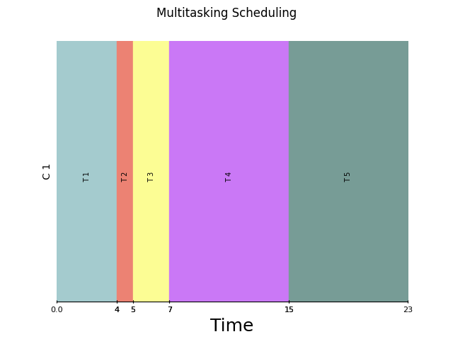
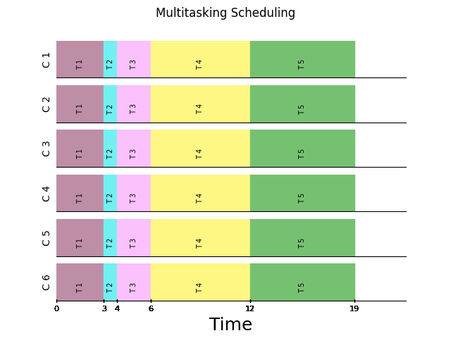

# Scheduling

The goal of the schedular is to minimize the Makespan.

## Makespan

**Makespan** of a project is the length of time that elapses from the start of work to the end. This type of multi-mode
resource constrained project scheduling problem (MRCPSP) seeks to create the shortest logical project schedule, by
efficiently using project resources, adding the lowest number of additional resources as possible to achieve the minimum
makespan

## Algorithms

### Cooperative

The first greedy approach is the cooperative scheduling. The cooperative approach tries to minimize the Makespan
locally.

By assigning all cores to a single task, we can expect the minimum execution time. (This may be a bit simplistic, but it
is quite correct most of the time)

The main disadvantage of cooperative algorithms comes from the fact that using M cores won't cause M times faster
execution or even close to it. The parallel nature of a task specify the impact of using multiple cores.

Let's continue our discussion with a simple example.

| parallel portion | exe_1 | exe_2 | exe_3 | exe_4 | exe_5 | exe_6 |
|------------------|-------|-------|-------|-------|-------|-------|
| 0.25             | 4.01  | 3.51  | 3.34  | 3.26  | 3.21  | 3.17  |
| 0.24             | 1.07  | 0.94  | 0.9   | 0.88  | 0.86  | 0.86  |
| 0.07             | 2.41  | 2.33  | 2.3   | 2.28  | 2.28  | 2.27  |
| 0.2              | 7.96  | 7.16  | 6.9   | 6.77  | 6.69  | 6.63  |
| 0.14             | 7.88  | 7.33  | 7.14  | 7.05  | 7.0   | 6.96  |

The first column shows the parallel portion of the program and next columns show the theoretical execution time of a
task
by using `_C` core

The following plot shows the execution of these tasks on a single core and a multicore.

    
    &nbsp; &nbsp; &nbsp; &nbsp;
    

The following formula can be used as a heuristic to show the improvement:

$$
\text{Imp} = \frac{\frac{\text{multicore exe time}}{\text{single core exe time}}}{\text{number of core}}
$$

for the following example, the `Imp` will be $` \frac{\frac{\text{19}}{\text{23}}}{\text{6}} = 0.13 `$ which indicates that
there is not much improvement.

Utilizing multiple cores with a cooperative algorithm may yield a slight improvement in performance, yet it may incur significant costs when handling tasks that are not inherently parallel.
