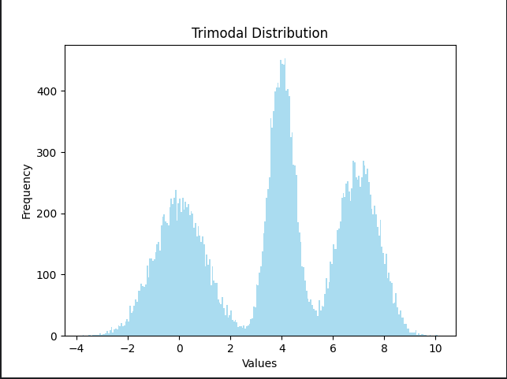

# Task Generator

To obtain logical outputs, the task behavior must be model carefully.
For the sake of optimizing `Makespan` by using multicore device, the worst-case execution time and power related
parameters must be set due to the number of cores.

## Task Modeling

Each `Task` is modeled based on:

1. $T_i(C)$ Indicates the Worst Execution time of `Task i`
2. $P_i(C)$ Indicates the Power Consumption of `Task i`
3. $E_i(C)$ Indicates the Energy Consumption of `Task i`

where `C` is the number of cores.

### Execution Time

The impact of using extra cores for doing a specific task, depends heavily on the behaviour of the task.

Consider these two tasks:

`Search` given an array and a key, find if the key is exists in array or not:

```python
# SINGLE CORE
for v in array:
    if key == v: return True

# MULTIPLE CORE
chunk_size = len(array) / C  # C is the number of cores

foreach
t in threads:
for v in array(t.id, t.id + chunk_size)
    if key == v: return True
```

<br></br>

`Linear Programming` given a logical relation between $f(i)$ and $f(i - 1 ... 0)$ compute $f(i)$ for all iterations.

```python
f: func
# SINGLE CORE
for i in range(N):
    f(i, f(0), f(1), ...)

# MULTIPLE CORE -> NO DIFFRENCE
```

Therefore, impact of using multiple cores is unknown unless the behavior of the tasks are determined.

The naive approach is to use the Amdahl's law to predict the theorical speed up.

$$
\text{Speed Up}= \frac{1}{(1 - p) + \frac{p}{C}}
$$

where $p$ is the parallel portion of the program and $C$ is the number of cores.

### Power Consumption

The power consumption of a many core system depends on may different factors but the basic modeling is as below:

$$ P ~ C \times V^2 \times F $$

Where C is the number of cores, V is the system voltage and F is the frequency of the system.

### Task Generating

After modeling the tasks, we must be able to generate and sample different types of tasks for better test results.

The **Task Generator** model relies on below arguments:

1) `p : parallel portion` distribution: specify the potential of each task parallelization
2) `WS: wort case execution time` distribution: specify the execution time of each task in single core
3) `E: energy consumption` distribution: specify the energy consumption of tasks

#### Multi Modal Distribution

The `normal distribution` is not quite a good option for sampling. The reason is that there is no guarantee
that most of the tasks are not simple or complex tasks. The better distribution can be the
multi-modal distribution which is simply the concatenation of multiple normal distributions.

In this case we can assume there exists 3 types of tasks:

- simple tasks: can be done much faster

- normal tasks: The execution time is not that fast nor slow

- complex tasks: These tasks may need more time to compute in compression with previous types.

<br></br>

